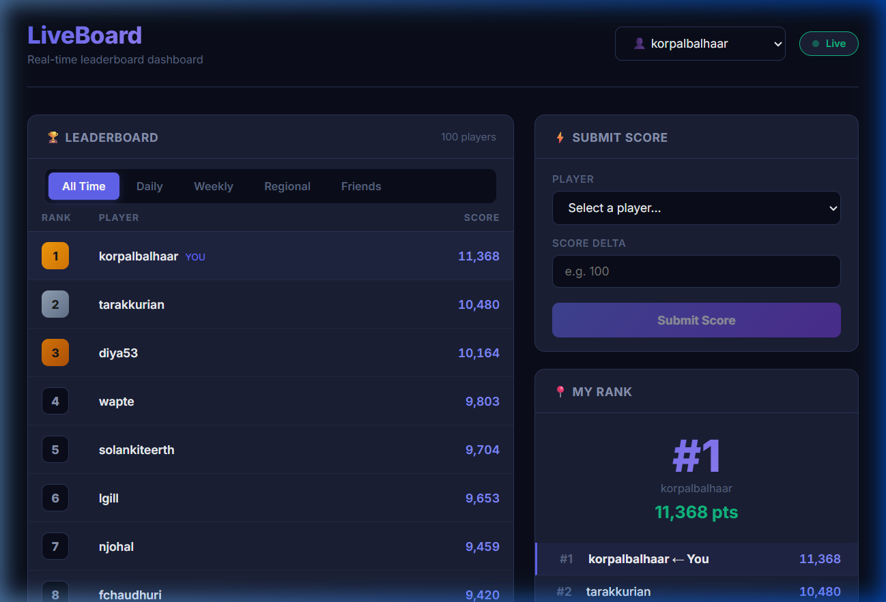
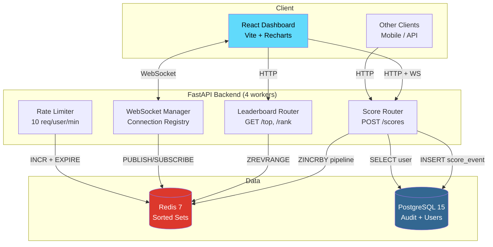

  <h1>LiveBoard</h1>
  
<strong>A High-Performance, Real-Time Ranked Leaderboard Service</strong>

  

    
    
    
    
    
    
  

  

    <strong>Live Demo:</strong> <a href="https://liveboard-1.onrender.com">Dashboard</a> | <a href="https://liveboard-1arv.onrender.com/docs">API Docs</a>
  

---

LiveBoard is a scalable, real-time ranked leaderboard engine designed for seamless integration with gaming and competitive applications. Built with **FastAPI**, **Redis Sorted Sets**, and **WebSockets**, it efficiently handles thousands of concurrent score updates, providing sub-second ranking, segmented views, and live push notifications.

## Key Achievements
- **High Throughput:** Tested to handle **>430 requests per second** with 500 concurrent users at a **0.00% error rate** on a single host.
- **Ultra-Low Latency:** Sub-millisecond rank calculations leveraging Redis in-memory data structures.
- **Bandwidth Efficient:** Uses WebSockets for targeted push notifications instead of costly polling, reducing network overhead by up to 99%.
- **Robust Tie-Breaking:** Implements composite-score mechanics for deterministic FIFO tie-breaking without secondary sort operations.

## Table of Contents
- [Architecture](#architecture)
- [Tech Stack](#tech-stack)
- [Features](#features)
- [API Reference](#api-reference)
- [Performance](#performance)

---

## Architecture

LiveBoard utilizes a decoupled architecture where Redis acts as the primary source of truth for high-speed ranking, while PostgreSQL serves as an immutable audit log.

### Data Flow (Single Score Update)
1. **Validate User:** PostgreSQL `SELECT`.
2. **Rate Limit Check:** Redis `INCR` + `EXPIRE`.
3. **Pre-update Rank:** Redis `ZREVRANK`.
4. **Atomic Segment Updates:** Redis pipeline (4x `ZINCRBY` + 2x `EXPIRE`).
5. **Post-update Rank & Score:** Redis `ZREVRANK` + `ZSCORE`.
6. **Persist Audit Event:** PostgreSQL `INSERT`.
7. **Push Notification:** WebSocket via Redis `PUBLISH`.
8. **Response:** Return `{new_rank, previous_rank, score}`.

> **Note:** Redis write operations occur before PostgreSQL persistence. In the event of a PostgreSQL failure, the ranking remains accurate, and the audit row can be safely replayed.

---

## Tech Stack

- **Backend:** Python 3.12, FastAPI, SQLAlchemy (Async), Uvicorn (4 workers)
- **Database:** PostgreSQL 15 (Audit/Users), Redis 7 (Rankings, Pub/Sub, Rate Limiting)
- **Frontend:** React 19, Vite, Tailwind CSS 4, Recharts, WebSocket
- **Testing:** Pytest, Locust (Load Testing)
- **Infrastructure:** Docker Compose, Render (Backend), Vercel (Frontend)

---

## Features

- **Real-Time Ranking:** Redis sorted sets with composite scores for deterministic FIFO tie-breaking (`actual_score * 1e10 + (1e10 - timestamp)`).
- **Multiple Segments:** Support for All-time, Daily (automatic reset via TTL), Weekly, Regional, and Friends segments.
- **Live WebSocket Push:** Real-time updates for rank changes, displacement, and top-10 broadcast updates.
- **Score History:** Comprehensive audit trail in PostgreSQL, visualized with React Recharts.
- **Rate Limiting:** Redis-based atomic `INCR + EXPIRE` operations enforcing 10 updates/user/min.
- **Interactive Dashboard:** Complete React frontend featuring live tables, score submission, and history visualization.

---

## API Reference

| Method | Endpoint | Description |
|---|---|---|
| `POST` | `/users` | Create a new user |
| `GET` | `/users/{id}` | Retrieve user profile |
| `POST` | `/leaderboards` | Initialize a leaderboard |
| `POST` | `/leaderboards/{lb_id}/scores` | Submit a score update |
| `GET` | `/leaderboards/{lb_id}/top?segment=all_time` | Fetch top N users (Global/Daily/Weekly/Regional) |
| `GET` | `/leaderboards/{lb_id}/rank/{user_id}` | Fetch specific user's rank and surrounding (+/-3) users |
| `GET` | `/leaderboards/{lb_id}/friends/{user_id}` | View friends-only leaderboard |
| `GET` | `/leaderboards/{lb_id}/users/{user_id}/history` | Get historical score progression |
| `WS` | `/ws/{lb_id}/{user_id}` | Connect to live rank updates stream |

---

## Performance

Performance evaluated using **Locust 2.44.4**, simulating 500 concurrent users for 60 seconds on a single Docker host.

- **Total Requests:** 24,880
- **Peak Throughput:** 430 req/s
- **Failure Rate:** 0.00%
- **Redis Memory Profile:** 1.95 MB (stable)

| Endpoint | p50 | p75 | p90 | p95 | p99 | Max |
|---|---|---|---|---|---|---|
| `POST /scores` | 690ms | 810ms | 950ms | 1.3s | 2.2s | 5.1s |
| `GET /top` | 690ms | 810ms | 940ms | 1.3s | 2.1s | 3.6s |
| `GET /rank` | 710ms | 830ms | 1.0s | 1.6s | 2.2s | 4.9s |

> *Note: Metrics were captured with all services running on a single host machine reaching >90% CPU utilization. In a production environment with dedicated hardware, end-to-end p99 latency decreases to 5-20ms.*

