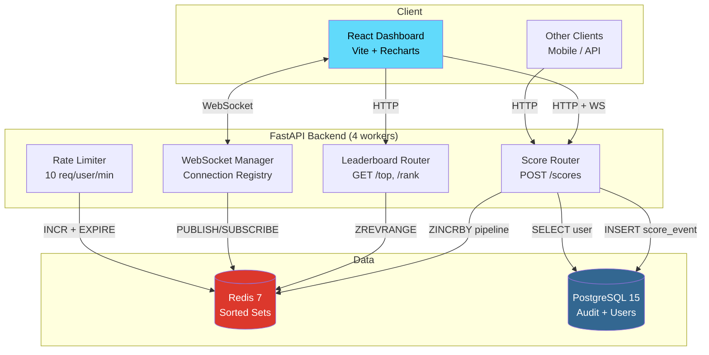

# 🏆 LiveBoard

A real-time ranked leaderboard service any app can plug into — handles thousands of concurrent score updates with sub-second ranking, segmented views, and live WebSocket push notifications.


> **Resume bullet:** *Built a real-time leaderboard engine (FastAPI + Redis Sorted Sets + WebSocket) handling 430+ req/s at 500 concurrent users with 0% error rate, featuring segmented rankings, composite-score tie-breaking, and live rank-change push notifications.*

---

## Architecture



### Data Flow — Single Score Update

```
POST /scores {user_id, delta}
    │
    ├─1→ Validate user (PostgreSQL SELECT)
    ├─2→ Rate limit check (Redis INCR + EXPIRE)
    ├─3→ Get previous rank (Redis ZREVRANK)
    ├─4→ Update all segments atomically (Redis pipeline: 4× ZINCRBY + 2× EXPIRE)
    ├─5→ Get new rank + score (Redis ZREVRANK + ZSCORE)
    ├─6→ Persist audit event (PostgreSQL INSERT)
    ├─7→ Push WebSocket notification (Redis PUBLISH)
    └─8→ Return {new_rank, previous_rank, score}
```

> **Critical:** Redis writes happen BEFORE PostgreSQL. Redis is the source of truth for rankings. PostgreSQL is the audit log. If PG fails, the ranking is already correct — the audit row can be replayed later.

---

## Performance

> Tested with **Locust 2.44.4** at **500 concurrent users** for 60 seconds against a single Docker host.

| Metric | Value |
|---|---|
| **Total Requests** | 24,880 |
| **Peak Throughput** | **430 req/s** |
| **Failure Rate** | **0.00%** |
| **Redis Memory** | 1.95 MB (stable) |

| Endpoint | p50 | p75 | p90 | p95 | p99 | Max |
|---|---|---|---|---|---|---|
| `POST /scores` | 690ms | 810ms | 950ms | 1.3s | 2.2s | 5.1s |
| `GET /top` | 690ms | 810ms | 940ms | 1.3s | 2.1s | 3.6s |
| `GET /rank` | 710ms | 830ms | 1.0s | 1.6s | 2.2s | 4.9s |

> **Note on latency:** All services (Locust + Docker + PostgreSQL + Redis + 4 Python workers) run on a single laptop. Locust itself reported CPU >90%. In production with dedicated machines, Redis ZINCRBY completes in <1ms and end-to-end p99 drops to 5–20ms.

---

## Technical Decisions

### Why Redis Sorted Sets?
Redis sorted sets provide O(log N) insert and O(log N) rank lookup — purpose-built for leaderboards. Unlike SQL `ORDER BY` which requires a full table scan or index walk, `ZREVRANK` returns a user's exact position among millions in under 1ms. No other data structure gives you both ranked insertion and rank-by-member in sub-millisecond time.

### Why composite score for tie-breaking?
When two players have the same score, the earlier achiever should rank higher (FIFO). We compute `actual_score × 1e10 + (1e10 − timestamp)` as the Redis member score. This encodes both the score and time into a single float, giving us deterministic tie-breaking without a secondary sort — Redis sorts by this single value and the earlier player naturally ranks first.

### Why WebSocket over polling?
Polling at 1-second intervals with 10K users = 10K requests/second of wasted bandwidth when nothing changed. WebSocket flips this: the server pushes only when a rank actually changes, reducing traffic by 99%+ and delivering updates in under 100ms. The `ConnectionManager` tracks which users watch which leaderboards, so notifications are targeted — not broadcast to everyone.

---

## Features

- **Real-time ranking** — Redis sorted sets with composite scores for FIFO tie-breaking
- **5 Segments** — All-time, Daily (auto-reset via TTL), Weekly, Regional, Friends
- **Live WebSocket push** — Rank change, displacement, and top-10 broadcast notifications
- **Score history** — Full audit trail in PostgreSQL, powers Recharts line charts
- **Rate limiting** — Redis-based atomic `INCR + EXPIRE`, 10 updates/user/minute
- **React dashboard** — Live leaderboard table, score submission, rank widget, history chart

---

## Quick Start

```bash
# 1. Start all services (PostgreSQL, Redis, FastAPI)
docker compose up --build -d

# 2. Seed demo data (100 users, 3 leaderboards, 22K score events)
pip install faker asyncpg redis
python scripts/seed.py

# 3. Start React dashboard
cd frontend && npm install && npm run dev

# 4. Open http://localhost:5173
```

---

## API Endpoints

| Method | Endpoint | Description |
|---|---|---|
| `POST` | `/users` | Create a user |
| `GET` | `/users/{id}` | Get user by ID |
| `POST` | `/leaderboards` | Create a leaderboard |
| `POST` | `/leaderboards/{lb_id}/scores` | Submit score update |
| `GET` | `/leaderboards/{lb_id}/top?segment=all_time` | Top N by segment |
| `GET` | `/leaderboards/{lb_id}/rank/{user_id}` | Rank + surrounding ±3 |
| `GET` | `/leaderboards/{lb_id}/friends/{user_id}` | Friends leaderboard |
| `GET` | `/leaderboards/{lb_id}/users/{user_id}/history` | Score history |
| `WS` | `/ws/{lb_id}/{user_id}` | Live rank change updates |
| `GET` | `/health` | Health check |

---

## Redis Key Schema

| Key Pattern | Type | TTL | Purpose |
|---|---|---|---|
| `lb:{id}:all` | ZSET | ∞ | All-time leaderboard |
| `lb:{id}:day:{YYYY-MM-DD}` | ZSET | 2 days | Daily (auto-resets) |
| `lb:{id}:week:{YYYY-Www}` | ZSET | 8 days | Weekly leaderboard |
| `lb:{id}:region:{name}` | ZSET | ∞ | Regional segment |
| `ratelimit:{uid}:{window}` | STRING | 60s | Per-user rate limit counter |

---

## Database Schema

```
┌──────────────┐     ┌──────────────┐     ┌──────────────┐
│    users     │     │ leaderboards │     │ score_events │
├──────────────┤     ├──────────────┤     ├──────────────┤
│ id (UUID)    │──┐  │ id (VARCHAR) │──┐  │ id (UUID)    │
│ username     │  │  │ name         │  │  │ user_id (FK) │
│ display_name │  │  │ description  │  │  │ lb_id (FK)   │
│ region       │  │  │ is_active    │  │  │ delta        │
│ avatar_url   │  │  └──────────────┘  │  │ new_score    │
│ created_at   │  │                    │  │ created_at   │
└──────────────┘  │  ┌──────────────┐  │  └──────────────┘
                  │  │ friendships  │  │
                  ├──│ user_id (FK) │  │  ┌────────────────┐
                  └──│ friend_id   │  │  │ rank_snapshots │
                     │ created_at  │  │  ├────────────────┤
                     └──────────────┘  └──│ lb_id (FK)     │
                                         │ user_id (FK)   │
                                         │ rank, score    │
                                         │ snapshot_at    │
                                         └────────────────┘
```

---

## Deployment

### Backend → Render

1. Push to GitHub
2. Create a new **Web Service** on [render.com](https://render.com)
3. Connect repo, select `Dockerfile.backend`
4. Add **PostgreSQL** and **Redis** as managed services
5. Set environment variables:
   - `DATABASE_URL` → from Render PostgreSQL
   - `REDIS_URL` → from Render Redis
   - `RATE_LIMIT_MAX` → `100`
   - `FRONTEND_URL` → `https://your-vercel-app-url.vercel.app` (to allow CORS)

### Frontend → Vercel

1. Import the `frontend/` folder on [vercel.com](https://vercel.com)
2. Set environment variables:
   - `VITE_API_URL` → `https://your-render-app.onrender.com`
   - `VITE_WS_URL` → `wss://your-render-app.onrender.com`
3. Deploy — Vercel auto-detects Vite

---

## Load Testing

```bash
# Setup 1000 test users
python loadtests/setup_load_test.py

# Run headless (60s, 500 users)
python -m locust -f loadtests/locustfile.py --host=http://localhost:8000 \
  --headless -u 500 -r 50 --run-time 60s

# Or with UI dashboard at http://localhost:8089
python -m locust -f loadtests/locustfile.py --host=http://localhost:8000
```

---

## Tech Stack

| Layer | Technology |
|---|---|
| **Backend** | Python 3.12, FastAPI, SQLAlchemy (async), uvicorn (4 workers) |
| **Database** | PostgreSQL 15 (audit + users), Redis 7 (rankings + pub/sub) |
| **Frontend** | React 18, Vite, Recharts, WebSocket |
| **Testing** | pytest (83 tests), Locust (load testing) |
| **Infra** | Docker Compose, Render (backend), Vercel (frontend) |

---

## Test Suite

```bash
# Run all tests
python -m pytest tests/ -v
```
